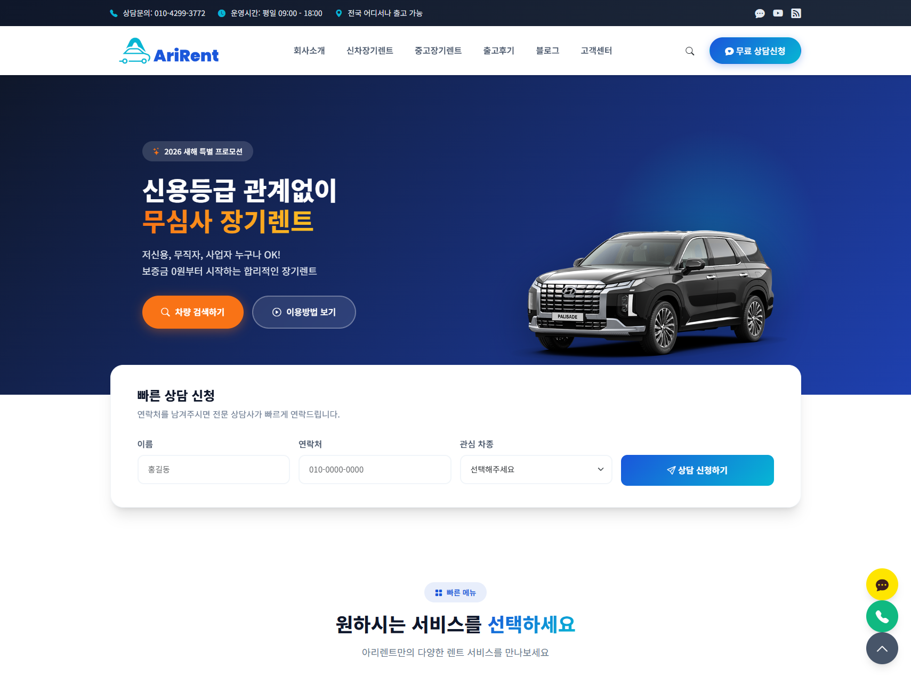

# AriRent 마케팅 랜딩 페이지 가이드

이 폴더는 AriRent 렌터카 솔루션 판매를 위한 마케팅 랜딩 페이지를 관리합니다.

## 프로젝트 개요

- **목적**: AriRent 렌터카 솔루션을 소개하고 판매하는 원페이지 랜딩 페이지 제작
- **타겟**: 렌터카 사업을 시작하려는 예비 창업자, 기존 렌터카 업체

## 디자인 리소스

### 이미지 파일 구조
- `frontend-xx-*.png`: 프론트엔드(고객용) 데스크탑 화면
- `mobile-xx-*.png`: 프론트엔드(고객용) 모바일 화면
- `backend-xx-*.png`: 백엔드(관리자용) 화면

### 이미지 네이밍 규칙

**프론트엔드 (데스크탑)**
```
frontend-01-메인페이지.png
frontend-02-렌트카차량목록.png
frontend-03-렌트카차량상세정보.png
frontend-04-일반게시판목록.png
frontend-05-블로그형게시판목록.png
frontend-06-예약페이지.png
frontend-07-마이페이지.png
...
```

**모바일**
```
mobile-01-메인페이지.png
mobile-02-렌트카차량목록.png
mobile-03-렌트카차량상세정보.png
...
```

**백엔드 (관리자)**
```
backend-01-대시보드.png
backend-02-차량관리.png
backend-03-예약관리.png
backend-04-회원관리.png
backend-05-게시판관리.png
backend-06-통계리포트.png
...
```

## 랜딩 페이지 제작 규칙

### 파일 네이밍
- 파일명: `lp-001.html`, `lp-002.html`, `lp-003.html` 형식
- 순차적으로 번호 증가

### 기술 스택
- **순수 HTML/CSS**: 프레임워크 없이 작성
- **애니메이션**: 사용하지 않음 (심플하게 유지)
- **반응형**: 모바일/태블릿/데스크탑 대응

### 필수 섹션 구성
1. **히어로 섹션**: 메인 카피, CTA 버튼
2. **기능 소개**: 주요 기능 하이라이트
3. **스크린샷 갤러리**: frontend/backend 이미지 쇼케이스
4. **가격 정책**: 요금제 안내 (선택)
5. **문의/CTA**: 연락처, 상담 신청 폼

### 스타일 가이드
```css
/* 기본 색상 */
--primary-color: #1a73e8;    /* 메인 브랜드 컬러 */
--secondary-color: #34a853;  /* 강조/액션 컬러 */
--text-color: #333333;       /* 본문 텍스트 */
--bg-light: #f8f9fa;         /* 밝은 배경 */

/* 폰트 */
font-family: 'Pretendard', -apple-system, BlinkMacSystemFont, sans-serif;
```

### 이미지 사용 예시
```html
<!-- 프론트엔드 데스크탑 -->



<!-- 모바일 -->


<!-- 백엔드 관리자 -->

```

## 주의사항

1. **심플함 유지**: 애니메이션, 복잡한 인터랙션 배제
2. **로딩 최적화**: 이미지 압축, lazy loading 적용
3. **접근성**: alt 태그, 적절한 heading 구조
4. **SEO**: meta 태그, semantic HTML 사용

## 작업 프로세스

1. 새 랜딩 페이지 요청 시 기존 `lp-*.html` 파일 확인
2. 마지막 번호 다음 번호로 새 파일 생성
3. 이미지 파일이 없으면 placeholder 사용 후 실제 이미지로 교체
